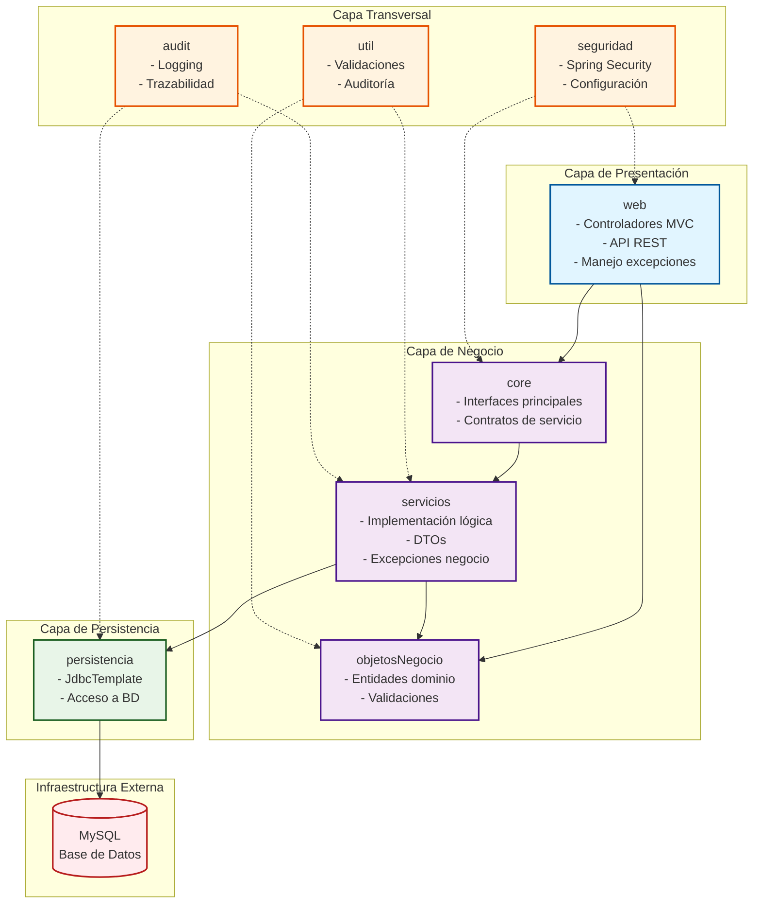

# Diagrama de Componentes UML - mod05proyMvcSpringBoot

## Arquitectura de Alto Nivel

```mermaid
C4Context
    title Diagrama de Componentes - Sistema de Ventas

    Person(usuario, "Usuario", "Usuario del sistema")
    
    System_Boundary(sistema, "Sistema de Ventas Spring Boot") {
        Container(web_controllers, "Controladores Web", "Spring MVC", 
            "Gestiona peticiones HTTP y vistas Thymeleaf")
        
        Container(rest_api, "API REST", "Spring Web", 
            "Expone endpoints RESTful para clientes externos")
        
        Container(servicios, "Servicios de Negocio", "Spring Services", 
            "Lógica de negocio y gestión de ventas")
        
        Container(core, "Core/Interfaces", "Java Interfaces", 
            "Contratos de servicios principales")
        
        Container(repositorio, "Repositorio/Persistencia", "Spring JDBC", 
            "Acceso a datos con JdbcTemplate")
        
        Container(seguridad, "Seguridad", "Spring Security", 
            "Autenticación y autorización")
        
        Container(objetos_negocio, "Objetos de Negocio", "Java POJOs", 
            "Entidades del dominio: Articulo, Categoria, Venta")
        
        Container(dtos, "DTOs", "Java DTOs", 
            "Objetos de transferencia de datos")
        
        Container(utilidades, "Utilidades", "Java Utils", 
            "Validaciones, auditoría, helpers")
    }

    System_Ext(mysql, "MySQL", "Base de Datos", 
        "Almacena toda la información del sistema")

    Rel(usuario, web_controllers, "Usa interfaz web")
    Rel(usuario, rest_api, "Consume API REST")
    
    Rel(web_controllers, core, "Depende de")
    Rel(rest_api, core, "Depende de")
    Rel(core, servicios, "Define contrato para")
    Rel(servicios, repositorio, "Utiliza para persistencia")
    Rel(repositorio, mysql, "Conecta y consulta")
    
    Rel(servicios, objetos_negocio, "Trabaja con")
    Rel(servicios, dtos, "Transforma a/desde")
    Rel(web_controllers, objetos_negocio, "Muestra en vistas")
    Rel(rest_api, objetos_negocio, "Serializa a JSON")
    
    Rel(seguridad, web_controllers, "Protege endpoints")
    Rel(seguridad, rest_api, "Protege endpoints")
    
    Rel(utilidades, servicios, "Proporciona utilidades")
    Rel(utilidades, objetos_negocio, "Valida entidades")

    UpdateRelStyle(usuario, web_controllers, $offsetY="-40")
    UpdateRelStyle(usuario, rest_api, $offsetY="-20")
    UpdateRelStyle(repositorio, mysql, $offsetX="60")
```

## Diagrama de Paquetes y Dependencias



## Descripción de Capas

### 1. **Capa de Presentación (web)**
- **Responsabilidad**: Manejar peticiones HTTP y generar respuestas
- **Componentes**:
  - `ApiVentasController`: Endpoints REST para artículos, categorías
  - `VentasController`: Controlador MVC para vistas Thymeleaf
  - `ValidacionException`, `ErrorCte`: Manejo de errores
- **Dependencias**: Core, ObjetosNegocio

### 2. **Capa de Negocio**
- **Core**: Define interfaces principales (`IGestorVentas`)
- **Servicios**: Implementa lógica de negocio (`GestorVentas`, `IGestorDatosSpring`)
- **ObjetosNegocio**: Entidades del dominio (Articulo, Categoria, Venta, Persona)
- **DTOs**: Objetos de transferencia para comunicación entre capas

### 3. **Capa de Persistencia (persistencia)**
- **Responsabilidad**: Acceso a base de datos
- **Componentes**:
  - `GestorDatosJdbcTemplate`: Implementación con Spring JDBC
  - `ConsultadorDatosGenerico`: Utilidad para consultas genéricas
- **Dependencias**: MySQL

### 4. **Capas Transversales**
- **Seguridad**: Configuración de Spring Security, autenticación básica
- **Util**: Validaciones personalizadas, utilidades
- **Audit**: Trazabilidad y logging de operaciones

### 5. **Infraestructura Externa**
- **MySQL**: Base de datos relacional que almacena:
  - Artículos, Categorías, Ventas, Detalles de Venta, Personas

## Flujo de Dependencias Principal

```
Usuario → Web → Core → Servicios → Persistencia → MySQL
                ↓        ↓
           ObjNegocio  DTOs
                ↓
            Utilidades
```

## Tecnologías Utilizadas

- **Framework**: Spring Boot 4.0.3
- **Java**: 21
- **Base de Datos**: MySQL
- **Persistencia**: Spring JDBC (JdbcTemplate)
- **Seguridad**: Spring Security
- **Vistas**: Thymeleaf
- **Validación**: Jakarta Validation (Bean Validation)
- **API**: REST con JSON